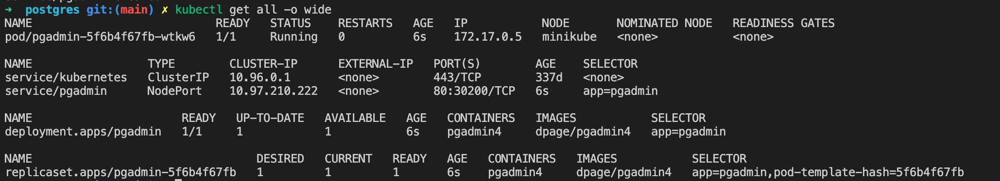

# pgadmin-k8s
Simple template for creation of k8s pgadmin

## Create postgres admin in k8s enviroment
In order to create all kubernetes components write following commands:
`kubectl apply -f postgres-secret.yaml` -> create secret needed to service
`kubectl apply -f postgres-deploy.yaml` -> create deploy of postgres database

## Output
After execution commands your k8s enviroment should look like following one:

# postgres-k8s
Simple template for creation of k8s pgadmin

## Create postgres admin in k8s enviroment
In order to create all kubernetes components write following commands:
`kubectl apply -f postgres-secret.yaml` -> create secret needed to service
`kubectl apply -f postgres-deploy.yaml` -> create deploy of postgres database

## Output
After execution commands your k8s enviroment should look like following one:

